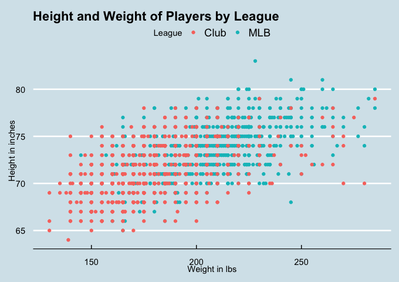
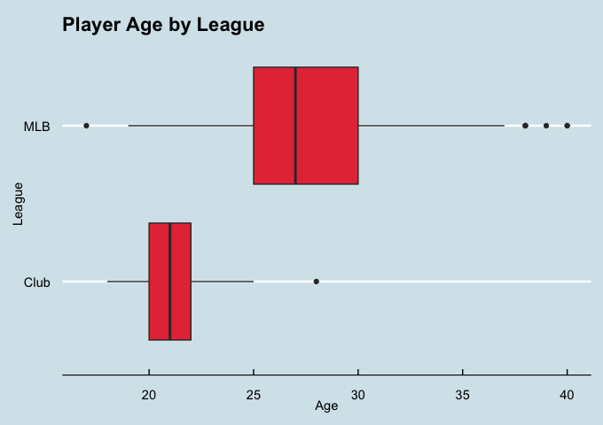
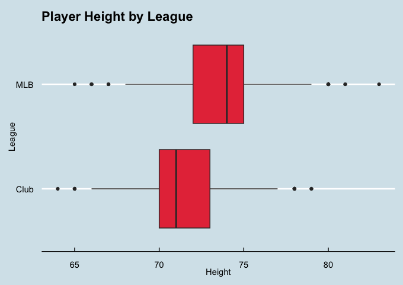
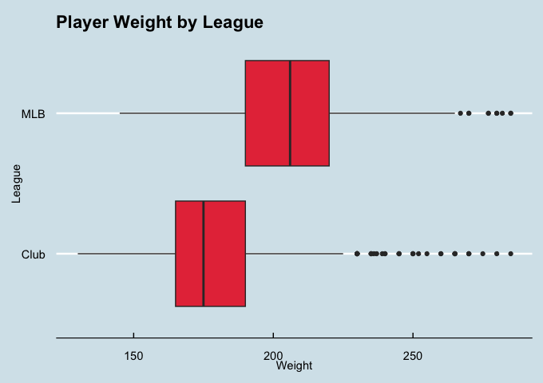

# MLB and Club Classification

**Table of Contents:** 
-- [Tools Used](#item-one) 
-- [Problem Description](#item-two) 
-- [Data Scraping](#item-three) 
-- [Data Cleaning](#item-four) 
-- [Exploratory Data Analysis Plots and Table](#item-five) 
-- [Model Fitting](#item-six) 
-- [Model Evaluation](#item-seven) 
-- [Conclusion](#item-eight) 
-- [Data Sources](#item-nine) 

## Tools Used

The tool used for this project is R.

The R library dependencies are tidyverse, rvest, rmarkdown, ggthemes, verification, MASS, e1071, class, neuralnet, and purrr.

## Project Description

To determine the level of baseball an individual plays at, either MLB (Major League Baseball) or NCBA (National Club Baseball Association), many classification models based on HT and WT were created, including KNN, logistic regression, linear discriminant analysis, quadratic discriminant analysis, Naive Bayes, and a neural network. The data for the model was obtained by scraping from the NCBA and ESPN MLB websites and cleaning it. Visualizations and a dashboard were created to show the differences between individual players from each of the two leagues, and classification models were fit, resulting in the final model of a logistic regression model, chosen by accuracy.

## Data Scraping

The MLB and Club Baseball data were both scraped in rvest. The NCBA data came from the team pages for every team in the league for the 2023-2024 season, found through the [main site](https://clubbaseball.org/) ([Example of a team site](https://clubbaseball.org/league/players/?season=b8856e04-ce36-4dc7-94cc-6e704cb0004d&team=9a403849-3af1-4f1a-923c-9ee81aa2caad)).

The MLB data came from ESPN's MLB website, by scraping every team's 2023 roster. An example of one of these team roster sites can be found [here](https://www.espn.com/mlb/team/roster/_/name/bal/baltimore-orioles).

## Data Cleaning

The NCBA data was cleaned in R using the tidyverse, to retrieve a data frame without missing entries and multiple attributes. The cleaned data frame was of dimensions 1242x16.

The MLB data was cleaned the same way. The dimensions were 1221x12.

The data was combined to result in a data frame of dimensions 2463x11, of the form,

| Attribute | Description |
|-----------|-------------|
| fname | character string of first name |
| lname | character string of last name |
| Age | double of player's age (calculated by current year - year born for NCBA players)
| HT | double of player height in inches |
| WT | double of player weight in pounds|
| city | character string of city from |
| state | character string of U.S. state abbreviation or country (ex. OH or Cuba) |
| POS | character string of position (ex. RP (relief pitcher), C, SS, P, etc.) |
| Team | character string of team name (ex. Baltimore Orioles or Ohio State) |
| League | factor of Club or MLB |
| MLB | logical: true for MLB, false for Club |

## Exploratory Data Analysis Plots and Table

| League | Mean Height | Mean Weight | Mean Age | Players |
|---|---|---|---|---|
| Club | 71.48631 | 179.0636 | 21.07810 | 1242 | 
| MLB | 73.74529 | 207.1474	| 27.38575 | 1221 |

## Model Fitting

Many classification models where fit for the problem, but the logisitc regression model performed best based on accuracy. The models fit were KNN, QDA, LDA, a neural network, Naive Bayes, and logistic regression.

The logistic regression model formula was
$$p(X)=\frac{e^{\beta_0+\beta_1HT_i+\beta_2WT_i}}{1+e^{\beta_0+HT_i+WT_i}}; i=1,...,n$$

The fitted model was

$`\hat{p_i}=logit(-19.109369+0.136833*HT_i+0.047340*WT_i); i=1,...,n`$

## Model Evaluation

The model had an accuracy of 79.43925%, with a residual deviance of 1802.9.
All coefficients were significant under a 95% hypothesis test.

## Conlusion

As the prediction results from the logistic regression show, predicting the level at which an individual play baseball at, either MLB or Club, can be done at a relatively high rate with just the height and weight of the players as independent variables using logistic regression.

## Data Sources

https://clubbaseball.org/

https://www.espn.com/mlb/
